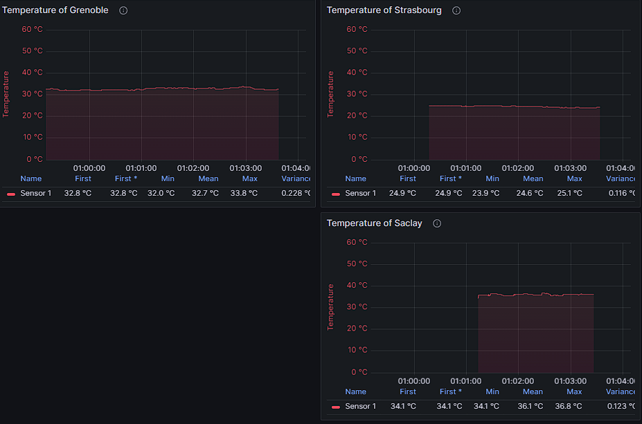
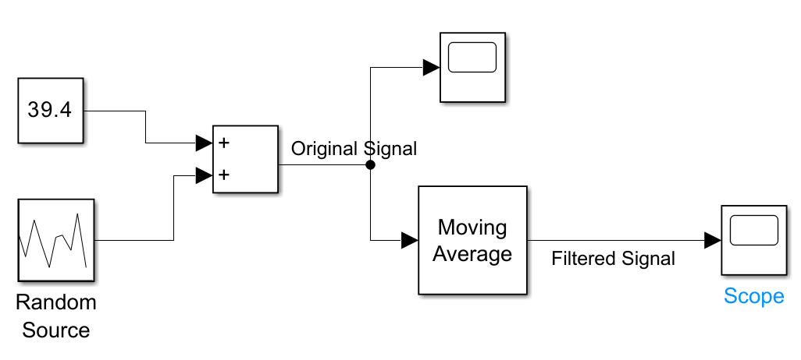
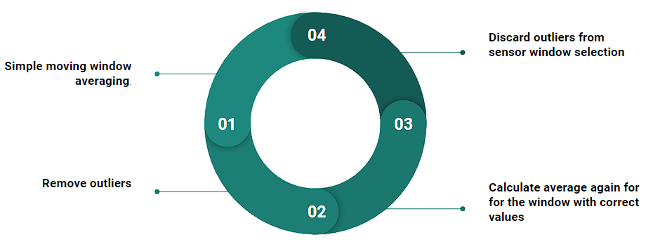
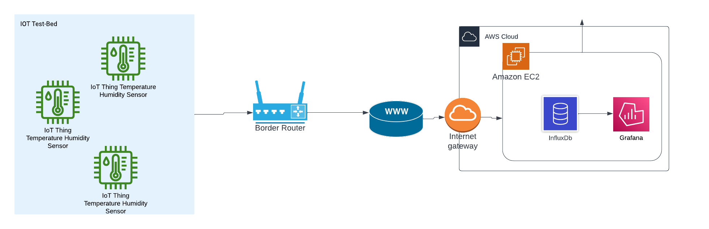

[![Contributors][contributors-shield]][contributors-url]
[![Forks][forks-shield]][forks-url]
[![Issues][issues-shield]][issues-url]
[![MIT License][license-shield]][license-url]


<!-- PROJECT LOGO -->
<br />
<div align="center">
  <a href="https://github.com/sense-iot/DataStreamPilot/blob/main/README.md">
    
  </a>

  <h3 align="center">Data Stream Pilot</h3>

  <p align="center">
    Data preparation pipeline on IoT Test Bed!
    <br />
    <a href="https://github.com/sense-iot/DataStreamPilot"><strong>Explore the docs »</strong></a>
    <br />
    <br />
    <a href="https://youtu.be/tnPCq7kCpds">View Demo</a>
    ·
    <a href="https://github.com/sense-iot/DataStreamPilot/issues">Report Bug</a>
    ·
    <a href="https://github.com/sense-iot/DataStreamPilot/issues">Request Feature</a>
  </p>
</div>
<br>
<div align="center">

 <a href="https://youtu.be/tnPCq7kCpds">
    
    </a>
</div>

<br>

<!-- TABLE OF CONTENTS -->
<details>
  <summary>Table of Contents</summary>
  <ol>
    <li>
      <a href="#about-the-project">About The Project</a>
      <ul>
        <li><a href="#built-with">Built With</a></li>
      </ul>
    </li>
    <li>
      <a href="#getting-started">Getting Started</a>
      <ul>
        <li><a href="#prerequisites">Prerequisites</a></li>
        <li><a href="#installation">Installation</a></li>
      </ul>
    </li>
    <li><a href="#roadmap">Roadmap</a></li>
    <li><a href="#Documentation">Documentation</a></li>
    <li><a href="#license">License</a></li>
    <li><a href="#contact">Contact</a></li>
    <li><a href="#acknowledgments">Acknowledgments</a></li>
  </ol>
</details>

## About The Project

This project demonstrate a data preparation pipeline. We have sensors which gives erronous data simuated by adding gaussian noise. Noise is really high such that sensors can be considered almost not working properly. Pipeline filters the noise in different stages save processed data to a database.

<a href="https://docs.google.com/presentation/d/1JgnVySCUP6uiH4VqiEE2zdFZ5dCnfMiBbF_r66pkAQw/edit?usp=sharing">Presentation : Google Slides</a>


### Built With

* [RIOT - Real Time operating system](https://www.riot-os.org/)

* [IoT-LAB M3 · FIT IoT-LAB](https://www.iot-lab.info/docs/boards/iot-lab-m3/) MCU boards

* [I2C Protocol](https://en.wikipedia.org/wiki/I%C2%B2C)

* [CoAP - Constrained Application Protocol](https://en.wikipedia.org/wiki/Constrained_Application_Protocol) - Constrained Application Protocol

* [Grafana](https://grafana.com/)

* [InfluxDB](https://www.influxdata.com/glossary/nosql-database/)

* [Amazon EC2](https://aws.amazon.com/ec2/)

* [Docker](https://www.docker.com/)

<p align="right">(<a href="#readme-top">back to top</a>)</p>

## Getting started

### Prerequisites

Test bed,

- You need an account in [FIT IoT Testbed](https://www.iot-lab.info/)
- Get SSH access. [SSH Access : FIT IoT Testbed](https://www.iot-lab.info/docs/getting-started/ssh-access/)
- For firstime use of command line tools you need authentication `iotlab-auth -u <login>`
- Next we recommend to follow our hello example [How to Run Hello | Sense Wiki](https://github.com/KRVPerera/sense/wiki/Running-our-Hello-world-in-F-I-T-IOT%E2%80%90LAB).

Server,

Server with IPv6 stack and public IPv6 address. This is because RIOT OS only has IPv6 stack support by the time we did this project. We are using an Amazon EC2 instance.

- AWS account with EC2 access
- Docker installed on the EC2 instance

References,

- [Design | FIT IoT Testbed](https://www.iot-lab.info/docs/getting-started/design/)
- [Sense Wiki](https://github.com/KRVPerera/sense/wiki)

<p align="right">(<a href="#readme-top">back to top</a>)</p>

### Installation

#### IoT Test Bed setup

- Clone the repository to the testbed. 
- Setup variables `SENSE_SITE` and `COAP_SERVER_IP` in `scripts\setup_env.sh`
```bash
# grenoble, paris, lille, saclay, strasbourg
export SENSE_SITE=grenoble
```
- System already setup for `grenoble`, `strasbourg` and `saclay`
  - If needed for each site you may have to change `BORDER_ROUTER_IP` assignment in the same script
  ```bash
  if [ "$SENSE_SITE" = "grenoble" ]; then
    # 2001:660:5307:3100::/64	2001:660:5307:317f::/64
    export BORDER_ROUTER_IP=2001:660:5307:313f::1/64
  elif [ "$SENSE_SITE" = "paris" ]; then
  ...
  ```
- Also in `scripts\mini_project2.sh` nodes are manually selected for the above same sites. If the nodes are not working now you have to select them in the script
```bash
if [ "$SENSE_SITE" = "grenoble" ]; then
    export BORDER_ROUTER_NODE=219
    export COMPUTE_ENGINE_NODE_1=220
    export COMPUTE_ENGINE_NODE_2=221
    export COMPUTE_ENGINE_NODE_3=222
elif [ "$SENSE_SITE" = "saclay" ]; then
    export BORDER_ROUTER_NODE=5
    export COMPUTE_ENGINE_NODE_1=7
```
- execute command `make run_mini_project_2` 

<p align="right">(<a href="#readme-top">back to top</a>)</p>

#### Server setup

Prerequisites

- AWS account with EC2 access

Setting Up EC2 and Assigning a Public IPv6 Address

1. **Create an EC2 Instance**

   - Launch an EC2 instance with a suitable AMI (Amazon Machine Image).
   - Ensure that the instance has the necessary permissions to interact with other AWS services.

2. **Assign a Public IPv6 Address**

   - Follow the [AWS Documentation](https://docs.aws.amazon.com/AWSEC2/latest/UserGuide/using-instance-addressing.html#ipv6-assign-instance) to assign a public IPv6 address to your EC2 instance.

3. **Configure Inbound Rules for CoAP**

   - Go to the AWS Management Console.
   - Navigate to the EC2 Dashboard.
   - Select your instance, go to the "Security" tab, and click on the associated Security Group.
   - In the Security Group settings, add an inbound rule for UDP at port 5683 for IPv6.

     ```plaintext
     Type: Custom UDP Rule
     Protocol: UDP
     Port Range: 5683
     Source: ::/0
     ```

     This allows incoming UDP traffic on port 5683 from any IPv6 address.
     
    - Note for Testing:
    For testing purposes, all IPv6 addresses are allowed (::/0). In a production environment, consider limiting access by applying a range of IPs.
4. **Configure Inbound Rules for Grafana**

   - Add an inbound rule for TCP at port 3000 for IPv4.

     ```plaintext
     Type: Custom TCP Rule
     Protocol: TCP
     Port Range: 3000
     Source: 0.0.0.0/0
     ```

     This allows incoming TCP traffic on port 3000 from any IPv4 address.
    - Note for Testing:
    For testing purposes, all IPv4 addresses are allowed (0.0.0.0/0). In a production environment, consider limiting access by applying a range of IPs.

Setting up the server

1. **Clone the Repository and**

   ```bash
   git clone <repository_url>
   cd <repository_directory>/src/server
   ```

2. **Install docker**

   Run the below script to install docker
   ```bash
   chmod +x install_docker.sh
   ./install_docker.sh
   ```

3. **Build and Deploy the CoAP Server, Influxdb and Grafana**

   ```bash
   docker-compose up -d
   ```

   This script builds the CoAP server Docker container and deploys it. This will also setup the Grafana dashboard visualizing time-series data and create influxdb instances as docker containers.

Usage: Grafana with InfluxDB


1. **Access Grafana Dashboard**

   - Open your web browser and go to `http://<public-ip>:3000/`.
     
<p align="right">(<a href="#readme-top">back to top</a>)</p>


## Dataprocessing

### Sensor layer

Matlab simulink to simulate SMA (simple moving window averaging)




Full pipeline inside the nodes



- calculate SMA and standard deviation for the window
- Remove outliers based on deviation factor `2.0`
- Use the cleanup window again to calculte more correct average
- Use new corrected window data to discard outliers from future sensor reading
- continue for each moving window


### Cloud and Edge


## Architecture



- More than one sensor 
- Temporal consistency checks 
  - Big sudden jumps 
- Spatial consistency checks 
  - More than one sensor 
- Historical data analysis 
  - Far away from history data 
  - Mean,  
- Rule based averaging 
- Data filtering 

What can we do 

- 3 sensors – we can rely on correct ones 

- Rely on data correction  

- Data rejection 

 Error correction codes 

- Can we reset the sensor?? 


<!-- DOCUMENTATION -->
## Documentation

### Sensor Layer

[docs/Sensor](SENSOR.md) explains our network layer

### Network Layer

[docs/Network](NETWORK.md) explains our network layer

### Data Layer

[docs/Server](NETWORK.md) explains our network layer

<p align="right">(<a href="#readme-top">back to top</a>)</p>

<!-- LICENSE -->
## License

Distributed under the MIT License. See `LICENSE.txt` for more information.

<p align="right">(<a href="#readme-top">back to top</a>)</p>


<!-- CONTACT -->
## Contact

Dilan Fernando - [![LinkedIn][linkedin-shield]][linkedin-url-dilan]

Nipun Waas - [MyPage](https://waasnipun.github.io/#contact)

Rukshan Perera - [MyPage](https://www.krvperera.com/#contact)


<p align="right">(<a href="#readme-top">back to top</a>)</p>


<!-- ACKNOWLEDGMENTS -->
## Acknowledgments

* [Choose an Open Source License](https://choosealicense.com)
* [Awesome Badges](https://dev.to/envoy_/150-badges-for-github-pnk)
* [Best README Template](https://github.com/othneildrew/Best-README-Template)

<p align="right">(<a href="#readme-top">back to top</a>)</p>


<!-- MARKDOWN LINKS & IMAGES -->
<!-- https://www.markdownguide.org/basic-syntax/#reference-style-links -->
[contributors-shield]: https://img.shields.io/github/contributors/sense-iot/DataStreamPilot.svg?style=plastic
[contributors-url]: https://github.com/sense-iot/DataStreamPilot/graphs/contributors
[forks-shield]: https://img.shields.io/github/forks/sense-iot/DataStreamPilot.svg?style=plastic
[forks-url]: https://github.com/sense-iot/DataStreamPilot/network/members
[stars-shield]: https://img.shields.io/github/stars/sense-iot/DataStreamPilot.svg?style=plastic
[stars-url]: https://github.com/sense-iot/DataStreamPilot/stargazers
[issues-shield]: https://img.shields.io/github/issues/sense-iot/DataStreamPilot.svg?style=plastic
[issues-url]: https://github.com/sense-iot/DataStreamPilot/issues
[license-shield]: https://img.shields.io/github/license/sense-iot/DataStreamPilot.svg?style=plastic
[license-url]: https://github.com/sense-iot/DataStreamPilot/blob/master/LICENSE.txt
[product-screenshot]: images/screenshot.png
[Next.js]: https://img.shields.io/badge/next.js-000000?style=plastic&logo=nextdotjs&logoColor=white
[Next-url]: https://nextjs.org/
[React.js]: https://img.shields.io/badge/React-20232A?style=plastic&logo=react&logoColor=61DAFB
[React-url]: https://reactjs.org/
[Vue.js]: https://img.shields.io/badge/Vue.js-35495E?style=plastic&logo=vuedotjs&logoColor=4FC08D
[Vue-url]: https://vuejs.org/
[linkedin-shield]: https://img.shields.io/badge/LinkedIn-0077B5?style=plastic&logo=linkedin&logoColor=white
[linkedin-url-dilan]: https://www.linkedin.com/in/dilan-fernando-78a875155/
