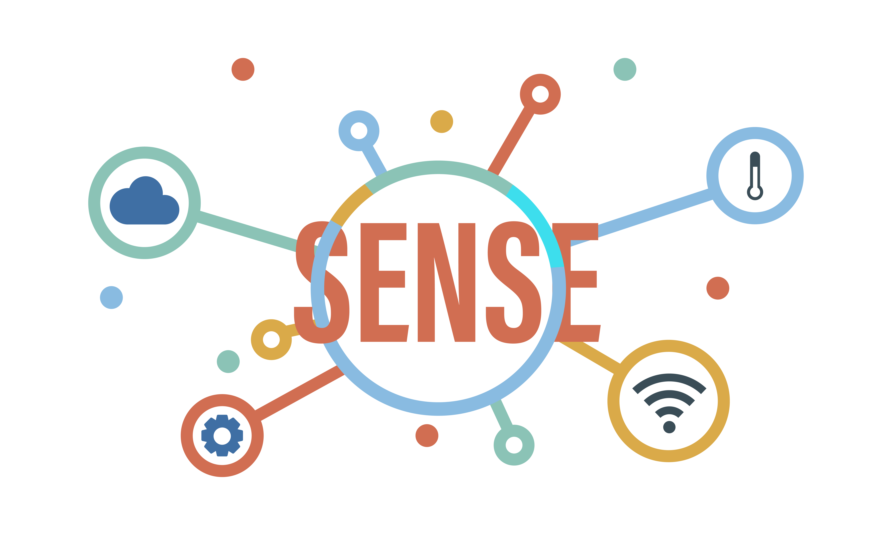

[![Contributors][contributors-shield]][contributors-url]
[![Forks][forks-shield]][forks-url]
[![Issues][issues-shield]][issues-url]
[![MIT License][license-shield]][license-url]

<!-- PROJECT LOGO -->
 

  

  <h3 align="center">Data Stream Pilot</h3>

  

    Data preparation pipeline on IoT Test Bed!
     
    <a href="https://github.com/sense-iot/DataStreamPilot"><strong>Explore the docs »</strong></a>
     
     
    <a href="https://www.youtube.com/watch?v=Y-Kq7G6Sz5Q">View Demo</a>
    ·
    <a href="https://github.com/sense-iot/DataStreamPilot/issues">Report Bug</a>
    ·
    <a href="https://github.com/sense-iot/DataStreamPilot/issues">Request Feature</a>
  

# DataStreamPilot

<a href="https://lucid.app/documents/embedded/a633abe1-4224-4045-9147-177685a1603f?invitationId=inv_e597e54b-fb08-4f05-bf6e-cfac77241e66#"> Chart </a>

- More than one sensor 
- Temporal consistency checks 
  - Big sudden jumps 
- Spatial consistency checks 
  - More than one sensor 
- Historical data analysis 
  - Far away from history data 
  - Mean,  
- Rule based averaging 
- Data filtering 

What can we do 

- 3 sensors – we can rely on correct ones 

- Rely on data correction  

- Data rejection 

- Error correction codes 

- Can we reset the sensor?? 

### Compression

[docs/COMPRESSION](docs/COMPRESSION.md)

<!-- MARKDOWN LINKS & IMAGES -->
<!-- https://www.markdownguide.org/basic-syntax/#reference-style-links -->
[contributors-shield]: https://img.shields.io/github/contributors/sense-iot/DataStreamPilot.svg?style=plastic
[contributors-url]: https://github.com/sense-iot/DataStreamPilot/graphs/contributors
[forks-shield]: https://img.shields.io/github/forks/sense-iot/DataStreamPilot.svg?style=plastic
[forks-url]: https://github.com/sense-iot/DataStreamPilot/network/members
[stars-shield]: https://img.shields.io/github/stars/sense-iot/DataStreamPilot.svg?style=plastic
[stars-url]: https://github.com/sense-iot/DataStreamPilot/stargazers
[issues-shield]: https://img.shields.io/github/issues/sense-iot/DataStreamPilot.svg?style=plastic
[issues-url]: https://github.com/sense-iot/DataStreamPilot/issues
[license-shield]: https://img.shields.io/github/license/sense-iot/DataStreamPilot.svg?style=plastic
[license-url]: https://github.com/sense-iot/DataStreamPilot/blob/master/LICENSE.txt
[product-screenshot]: images/screenshot.png
[Next.js]: https://img.shields.io/badge/next.js-000000?style=plastic&logo=nextdotjs&logoColor=white
[Next-url]: https://nextjs.org/
[React.js]: https://img.shields.io/badge/React-20232A?style=plastic&logo=react&logoColor=61DAFB
[React-url]: https://reactjs.org/
[Vue.js]: https://img.shields.io/badge/Vue.js-35495E?style=plastic&logo=vuedotjs&logoColor=4FC08D
[Vue-url]: https://vuejs.org/
